## 实战：编写图书管理系统

图书管理系统需要再次迎来升级，现在，我们可以直接访问网站来操作图书，这里我们给大家提供一个前端模板直接编写，省去编写前端的时间。

本次实战使用到的框架：Servlet+Mybatis+Thymeleaf

注意在编写的时候，为了使得整体的代码简洁高效，我们严格遵守三层架构模式：


就是说，表示层只做UI，包括接受请求和相应，给模板添加上下文，以及进行页面的解析，最后响应给浏览器；

业务逻辑层才是用于进行数据处理的地方，表示层需要向逻辑层索要数据，才能将数据添加到模板的上下文中；

数据访问层一般就是连接数据库，包括增删改查等基本的数据库操作，业务逻辑层如果需要从数据库取数据，就需要向数据访问层请求数据。

当然，贯穿三大层次的当属实体类了，我们还需要创建对应的实体类进行数据的封装，以便于在三层架构中进行数据传递。

接下来，明确我们要实现的功能，也就是项目需求：

图书管理员的登陆和退出（只有登陆之后才能进入管理页面）

图书的列表浏览（包括书籍是否被借出的状态也要进行显示）以及图书的添加和删除

学生的列表浏览

查看所有的借阅列表，添加借阅信息

首先创建admin表


插入一条数据


创建一个新的Java项目


配置好`Servlet`和`Thymeleaf`


删除掉默认创建的应用


修改一下pom.xml依赖

```xml
<dependency>
    <groupId>jakarta.servlet</groupId>
    <artifactId>jakarta.servlet-api</artifactId>
    <version>5.0.0</version>
    <scope>provided</scope>
</dependency>
<dependency>
    <groupId>org.projectlombok</groupId>
    <artifactId>lombok</artifactId>
    <version>1.18.22</version>
</dependency>
<dependency>
    <groupId>mysql</groupId>
    <artifactId>mysql-connector-java</artifactId>
    <version>8.0.27</version>
</dependency>
<dependency>
    <groupId>org.mybatis</groupId>
    <artifactId>mybatis</artifactId>
    <version>3.5.7</version>
</dependency>
```

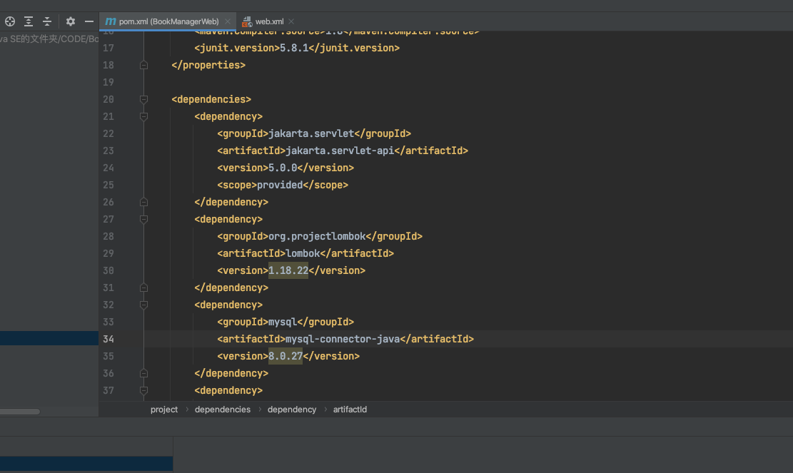

将模板的login.html移动到项目目录下的resources下

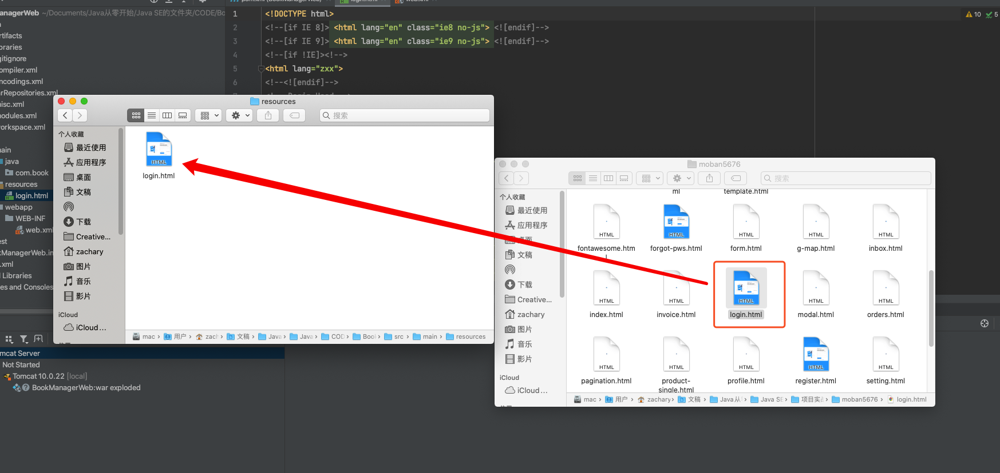

将模板下的static文件夹拷贝至项目目录下的webapp文件夹下

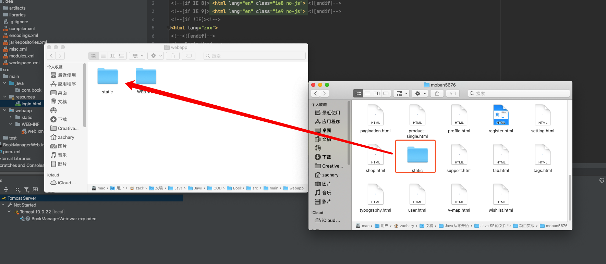

在Java文件夹下创建包名`com.book.servlet.auth`然后在包下创建第一个servlet`LoginServlet`

```java
package com.book.servlet;

import com.book.utils.ThymeleafUtil;
import jakarta.servlet.ServletException;
import jakarta.servlet.annotation.WebServlet;
import jakarta.servlet.http.HttpServlet;
import jakarta.servlet.http.HttpServletRequest;
import jakarta.servlet.http.HttpServletResponse;
import org.thymeleaf.context.Context;

import java.io.IOException;

@WebServlet("/login")
public class LoginServlet extends HttpServlet {
    @Override
    protected void doGet(HttpServletRequest req, HttpServletResponse resp) throws ServletException, IOException {
        ThymeleafUtil.process("login.html",new Context(),resp.getWriter());
    }
}

```

再创建一个包`com.book.utils`创建一个工具类，`ThymeleafUtil`

```java
package com.book.utils;

import org.thymeleaf.TemplateEngine;
import org.thymeleaf.context.IContext;
import org.thymeleaf.templateresolver.ClassLoaderTemplateResolver;

import java.io.Writer;

public class ThymeleafUtil {
    private static final TemplateEngine engine;
    static  {
        engine = new TemplateEngine();
        ClassLoaderTemplateResolver r = new ClassLoaderTemplateResolver();
        engine.setTemplateResolver(r);
    }

    public static void process(String template, IContext context, Writer writer){
        engine.process(template,context,writer);
    }


}
```

修改一下Tomcat的配置

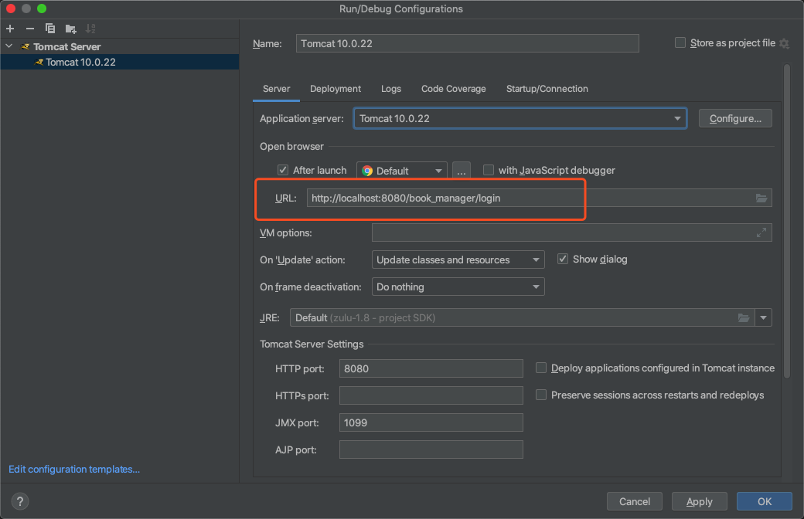

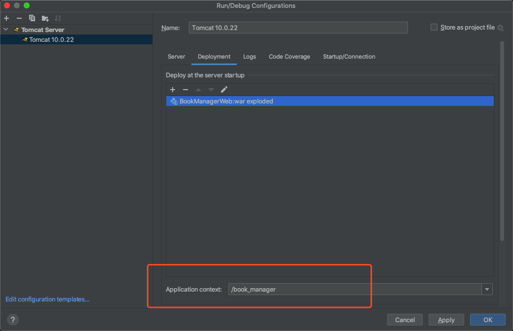

现在运行一下


修改一下原来的login.html

```html

```

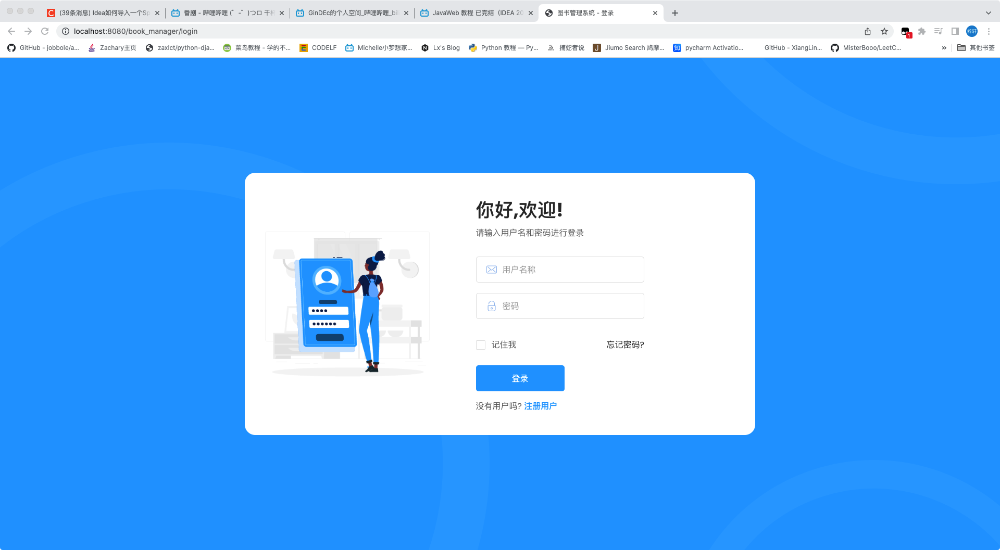

定义实体类包`com.book.entity`

创建实体类`User`

```java
package com.book.entity;

import lombok.Data;

@Data
public class User {
    int id;
    String username;
    String nickname;
    String password;
}
```

创建一个新的包`com.book.filter`，在包内创建`MainFilter`写一个过滤器

```java
package com.book.filter;

import com.book.entity.User;
import jakarta.servlet.FilterChain;
import jakarta.servlet.ServletException;
import jakarta.servlet.annotation.WebFilter;
import jakarta.servlet.annotation.WebServlet;
import jakarta.servlet.http.HttpFilter;
import jakarta.servlet.http.HttpServletRequest;
import jakarta.servlet.http.HttpServletResponse;
import jakarta.servlet.http.HttpSession;

import java.io.IOException;

@WebFilter("/ *")
public class MainFilter extends HttpFilter {
    @Override
    protected void doFilter(HttpServletRequest req, HttpServletResponse res, FilterChain chain) throws IOException, ServletException {
        String url = req.getRequestURL().toString();
        if (!url.contains("/static/") && !url.endsWith("login")) {
            HttpSession session = req.getSession();
            User user = (User) session.getAttribute("user");
            if (user == null){
                res.sendRedirect("login");
                return;
            }
        }
        chain.doFilter(req, res);
    }
}

```

在java下创建`com.book.dao`，创建`UserMapper`接口

```java
package com.book.dao;

import com.book.entity.User;
import org.apache.ibatis.annotations.Param;
import org.apache.ibatis.annotations.Select;

public interface UserMapper {
    @Select("select*  from admin where username = #{username} and password = #{password}")
    User getUser(@Param("username") String username, @Param("password") String password);
}
```

在resources文件夹下创建`mybatis-config.xml`

```xml
<?xml version="1.0" encoding="UTF-8" ?>
<!DOCTYPE configuration
        PUBLIC "-//mybatis.org//DTD Config 3.0//EN"
        "http://mybatis.org/dtd/mybatis-3-config.dtd">
<configuration>
    <environments default="development">
        <environment id="development">
            <transactionManager type="JDBC"/>
            <dataSource type="POOLED">
                <property name="driver" value="com.mysql.cj.jdbc.Driver"/>
                <property name="url" value="jdbc:mysql://localhost:3306/book_manage"/>
                <property name="username" value="root"/>
                <property name="password" value="980226"/>
            </dataSource>
        </environment>
    </environments>
    <mappers>
        <mapper class="com.book.dao.UserMapper"/>
    </mappers>
</configuration>
```

紧接着创建一个工具类`MybatisUtil`

```java
package com.book.utils;

import org.apache.ibatis.io.Resources;
import org.apache.ibatis.session.SqlSession;
import org.apache.ibatis.session.SqlSessionFactory;
import org.apache.ibatis.session.SqlSessionFactoryBuilder;

import java.io.IOException;

public class MybatisUtil {
    private static SqlSessionFactory factory;

    static {
        try {
            factory = new SqlSessionFactoryBuilder().build(Resources.getResourceAsReader("mybatis-config.xml"));
        } catch (IOException e) {
            e.printStackTrace();
        }

    }

    public static SqlSession getSession(){
        return factory.openSession(true);
    }
}

```

写业务逻辑层，新建一个包`com.book.service`

定义一个接口`UserService`

```java
package com.book.service;

import jakarta.servlet.http.HttpSession;

public interface Userservice {

    boolean auth(String username, String password, HttpSession session);
}

```

在这个包下面创建一个实现的包`com.book.service.impl`，在内部创建一个实现的`UserServiceImpl`

```java
package com.book.service.impl;

import com.book.dao.UserMapper;
import com.book.entity.User;
import com.book.service.Userservice;
import com.book.utils.MybatisUtil;
import jakarta.servlet.http.HttpSession;
import org.apache.ibatis.session.SqlSession;

public class UserServiceImpl implements Userservice {
    @Override
    public boolean auth(String username, String password, HttpSession session) {
        try (SqlSession sqlSession = MybatisUtil.getSession()) {
            UserMapper mapper = sqlSession.getMapper(UserMapper.class);
            User user = mapper.getUser(username, password);
            if (user == null) {
                return false;
            }
            session.setAttribute("user", user);
            return true;
        }


    }
}

```

最后修改一下LoginServlet

```java
package com.book.servlet;

import com.book.service.Userservice;
import com.book.service.impl.UserServiceImpl;
import com.book.utils.ThymeleafUtil;
import jakarta.servlet.ServletException;
import jakarta.servlet.annotation.WebServlet;
import jakarta.servlet.http.HttpServlet;
import jakarta.servlet.http.HttpServletRequest;
import jakarta.servlet.http.HttpServletResponse;
import org.thymeleaf.context.Context;

import java.io.IOException;

@WebServlet("/login")
public class LoginServlet extends HttpServlet {

    Userservice service;

    @Override
    public void init() throws ServletException {
        service = new UserServiceImpl();
    }

    @Override
    protected void doGet(HttpServletRequest req, HttpServletResponse resp) throws ServletException, IOException {
        Context context = new Context();
        if (req.getSession().getAttribute("login-failure") != null){
            context.setVariable("failure",true);
            req.getSession().removeAttribute("login-failure");
        }
        ThymeleafUtil.process("login.html",context,resp.getWriter());
    }

    @Override
    protected void doPost(HttpServletRequest req, HttpServletResponse resp) throws ServletException, IOException {
        String username = req.getParameter("username");
        String password = req.getParameter("password");
        String remember = req.getParameter("remember-me");
        if (service.auth(username,password, req.getSession())){
            resp.getWriter().write("Login success!");
        }else {
            req.getSession().setAttribute("login-failure",new Object());
            this.doGet(req,resp);
        }
    }
}
```

接下来加入一个新的页面，主页 ===> `index.html`


在`com.book.servlet.pages`包下创建一个新的`IndexServlet`

```java
package com.book.servlet;

import com.book.utils.ThymeleafUtil;
import jakarta.servlet.ServletException;
import jakarta.servlet.annotation.WebServlet;
import jakarta.servlet.http.HttpServlet;
import jakarta.servlet.http.HttpServletRequest;
import jakarta.servlet.http.HttpServletResponse;
import org.thymeleaf.context.Context;

import java.io.IOException;

@WebServlet("/index")
public class IndexServlet extends HttpServlet {
    @Override
    protected void doGet(HttpServletRequest req, HttpServletResponse resp) throws ServletException, IOException {
        ThymeleafUtil.process("index.html",new Context(), resp.getWriter());
    }
}

```

运行一下项目 登录后成功跳转

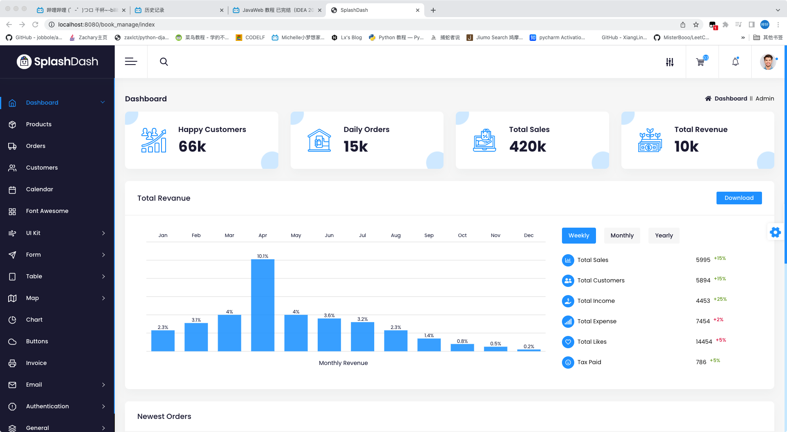

接下来修改一下这个`index.html`，让他变成一个我们的图书管理的界面

```html

```

并修改一下`IndexServlet`

```java
package com.book.servlet;

import com.book.entity.User;
import com.book.utils.ThymeleafUtil;
import jakarta.servlet.ServletException;
import jakarta.servlet.annotation.WebServlet;
import jakarta.servlet.http.HttpServlet;
import jakarta.servlet.http.HttpServletRequest;
import jakarta.servlet.http.HttpServletResponse;
import org.thymeleaf.context.Context;

import java.io.IOException;

@WebServlet("/index")
public class IndexServlet extends HttpServlet {
    @Override
    protected void doGet(HttpServletRequest req, HttpServletResponse resp) throws ServletException, IOException {
        Context context = new Context();
        User user = (User) req.getSession().getAttribute("user");
        context.setVariable("nickname",user.getNickname());

        ThymeleafUtil.process("index.html",context, resp.getWriter());
    }
}

```

可以看到页面已经精简很多了

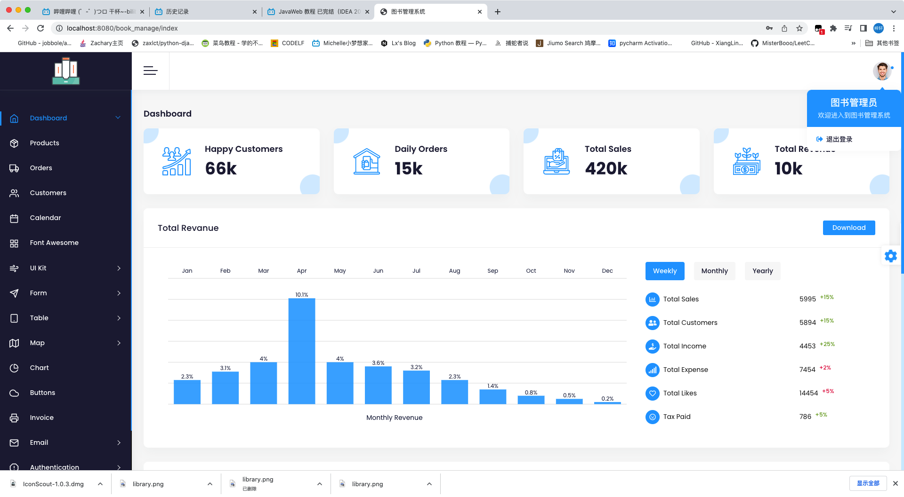

下一步哦，创建一个新的servlet，在包名`com.book.servlet.auth`下名称为`LogoutServlet`

```java
package com.book.servlet.auth;

import com.book.utils.ThymeleafUtil;
import jakarta.servlet.ServletException;
import jakarta.servlet.annotation.WebServlet;
import jakarta.servlet.http.HttpServlet;
import jakarta.servlet.http.HttpServletRequest;
import jakarta.servlet.http.HttpServletResponse;

import java.io.IOException;

@WebServlet("/logout")
public class LogoutServlet extends HttpServlet {
    @Override
    protected void doGet(HttpServletRequest req, HttpServletResponse resp) throws ServletException, IOException {
        req.getSession().removeAttribute("user");
        resp.sendRedirect("login");
    }
}

```

现在就可以实现退出啦

再次来修改一下index.html

```html

```

创建一个header.html

```html
<!DOCTYPE html>
<html lang="en" xmlns:th="http://www.thymeleaf.org">
<body>
<header class="header-wrapper main-header" th:fragment="title">
    <div class="header-inner-wrapper">
        <div class="logo-wrapper">
            <a href="" class="admin-logo">
                
            </a>
        </div>
        <div class="header-right">
            <div class="header-left">
                <div class="header-links">
                    <a href="javascript:void(0);" class="toggle-btn">
                        <span></span>
                    </a>
                </div>
            </div>
            <div class="header-controls">
                <div class="user-info-wrapper header-links">
                    <a href="javascript:void(0);" class="user-info">
                        
                        <div class="blink-animation">
                            <span class="blink-circle"></span>
                            <span class="main-circle"></span>
                        </div>
                    </a>
                    <div class="user-info-box">
                        <div class="drop-down-header">
                            <h4 th:text="${nickname}"></h4>
                            <p>欢迎进入到图书管理系统</p>
                        </div>
                        <ul>
                            <li>
                                <a href="logout">
                                    <i class="fas fa-sign-out-alt"></i> 退出登录
                                </a>
                            </li>
                        </ul>
                    </div>
                </div>
            </div>
        </div>
    </div>
</header>
</body>
</html>
```

现在就可以创建了一个模板了

给学生和书籍管理页安排上

创建一个`students.html`

```html

```

紧接着一样的写法在`com.book.servlet.pages`下创建一个`StudentServlet`

```java
package com.book.servlet.pages;

import com.book.entity.User;
import com.book.utils.ThymeleafUtil;
import jakarta.servlet.ServletException;
import jakarta.servlet.annotation.WebServlet;
import jakarta.servlet.http.HttpServlet;
import jakarta.servlet.http.HttpServletRequest;
import jakarta.servlet.http.HttpServletResponse;
import org.thymeleaf.context.Context;

import java.io.IOException;

@WebServlet("/students")
public class StudentServlet extends HttpServlet {
    @Override
    protected void doGet(HttpServletRequest req, HttpServletResponse resp) throws ServletException, IOException {
        Context context = new Context();
        User user = (User) req.getSession().getAttribute("user");
        context.setVariable("nickname",user.getNickname());
        ThymeleafUtil.process("students.html",context,resp.getWriter());
    }
}

```

运行一下，现在可以跳转到学生列表啦

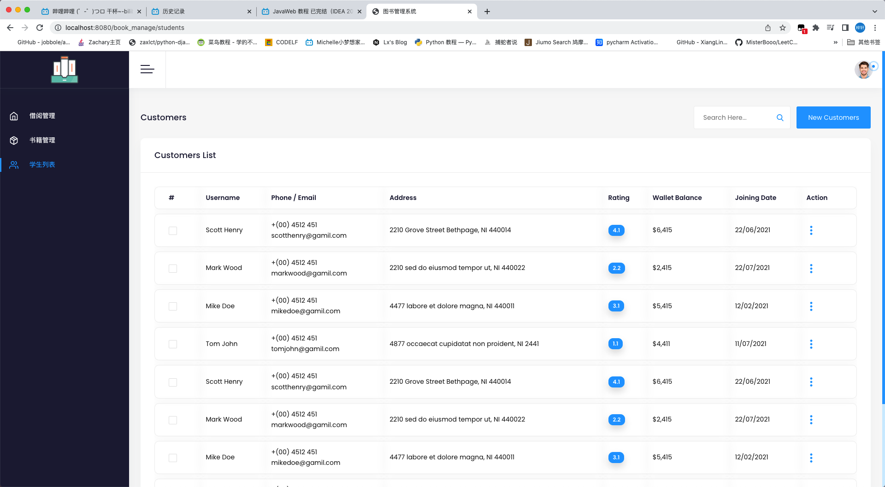

接下来看看图书列表

创建一个`books.html`

```html

```

再编写一下`com.book.servlet.pages.BookServlet`

```java
package com.book.servlet.pages;

import com.book.entity.User;
import com.book.service.BookService;
import com.book.service.impl.BookServiceImpl;
import com.book.utils.ThymeleafUtil;
import jakarta.servlet.ServletException;
import jakarta.servlet.annotation.WebServlet;
import jakarta.servlet.http.HttpServlet;
import jakarta.servlet.http.HttpServletRequest;
import jakarta.servlet.http.HttpServletResponse;
import org.thymeleaf.context.Context;

import java.io.IOException;

@WebServlet("/books")
public class BookServlet extends HttpServlet {

    @Override
    protected void doGet(HttpServletRequest req, HttpServletResponse resp) throws ServletException, IOException {
        Context context = new Context();
        User user = (User) req.getSession().getAttribute("user");
        context.setVariable("nickname",user.getNickname());
        ThymeleafUtil.process("books.html",context,resp.getWriter());
    }
}


```

修改一下数据库的borrow表


接下来修改一下 借阅列表的信息

修改 `index.html`

```html

```

添加一个实体类，在包`com.book.entity`下创建`Borrow`

```java
package com.book.entity;

import lombok.Data;

import java.util.Date;

@Data
public class Borrow {
    int id;
    int book_id;
    String book_name;
    Date time;
    String student_name;
    int student_id;
}


```

在`com.book.dao`包下面创建`BookMapper`的interface

```java
package com.book.dao;

import com.book.entity.Borrow;
import org.apache.ibatis.annotations.Result;
import org.apache.ibatis.annotations.Results;
import org.apache.ibatis.annotations.Select;

import java.util.List;

public interface BookMapper {

    @Results({
            @Result(column = "id",property = "id"),
            @Result(column = "bid",property = "book_id"),
            @Result(column = "title",property = "book_name"),
            @Result(column = "time",property = "time"),
            @Result(column = "name",property = "student_name"),
            @Result(column = "sid",property = "student_id")
    })
    @Select("select * from borrow, student, book where borrow.bid = book.bid and student.sid = borrow.sid")
    List<Borrow> getBorrowList();
}


```

在`com.book.service`包下面创建一个`BookService`的interface

```java
package com.book.service;

import com.book.entity.Borrow;

import java.util.List;

public interface BookService {
    List<Borrow> getBorrowList();
}

```

再在`com.book.service.impl`创建一个实现，`BookServiceImpl`

```java
package com.book.service.impl;

import com.book.dao.BookMapper;
import com.book.dao.UserMapper;
import com.book.entity.Borrow;
import com.book.service.BookService;
import com.book.utils.MybatisUtil;
import org.apache.ibatis.session.SqlSession;

import java.util.List;

public class BookServiceImpl implements BookService {

    @Override
    public List<Borrow> getBorrowList() {
        try (SqlSession sqlSession = MybatisUtil.getSession()){
            BookMapper mapper = sqlSession.getMapper(BookMapper.class);
            return mapper.getBorrowList();
        }
    }
}

```

更新一下`indexServlet`

```java
package com.book.servlet.pages;

import com.book.entity.User;
import com.book.service.BookService;
import com.book.service.impl.BookServiceImpl;
import com.book.utils.ThymeleafUtil;
import jakarta.servlet.ServletException;
import jakarta.servlet.annotation.WebServlet;
import jakarta.servlet.http.HttpServlet;
import jakarta.servlet.http.HttpServletRequest;
import jakarta.servlet.http.HttpServletResponse;
import org.thymeleaf.context.Context;

import java.io.IOException;

@WebServlet("/index")
public class IndexServlet extends HttpServlet {
    BookService service;

    @Override
    public void init() throws ServletException {
        service = new BookServiceImpl();
    }
    @Override
    protected void doGet(HttpServletRequest req, HttpServletResponse resp) throws ServletException, IOException {
        Context context = new Context();
        User user = (User) req.getSession().getAttribute("user");
        context.setVariable("nickname",user.getNickname());
        context.setVariable("borrow_list",service.getBorrowList());
        ThymeleafUtil.process("index.html",context, resp.getWriter());
    }
}

```

接着还要配置一下mapper

```xml
<?xml version="1.0" encoding="UTF-8" ?>
<!DOCTYPE configuration
        PUBLIC "-//mybatis.org//DTD Config 3.0//EN"
        "http://mybatis.org/dtd/mybatis-3-config.dtd">
<configuration>
    <environments default="development">
        <environment id="development">
            <transactionManager type="JDBC"/>
            <dataSource type="POOLED">
                <property name="driver" value="com.mysql.cj.jdbc.Driver"/>
                <property name="url" value="jdbc:mysql://localhost:3306/book_manage"/>
                <property name="username" value="root"/>
                <property name="password" value="980226"/>
            </dataSource>
        </environment>
    </environments>
    <mappers>
        <mapper class="com.book.dao.UserMapper"/>
        <mapper class="com.book.dao.BookMapper"/>
    </mappers>
</configuration>
```

运行一下项目

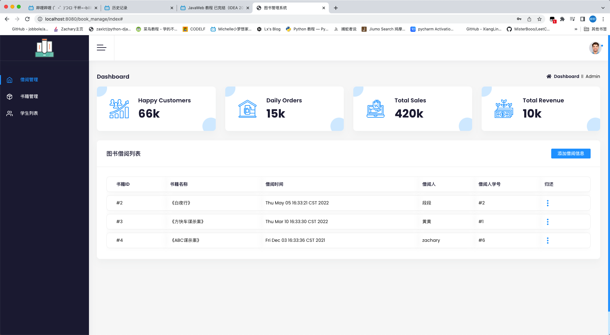

接下来完善一下归还功能

在`com.book.servlet`包下面创建`manage`包，并且创建一个`ReturnServlet`

```java
package com.book.servlet.manage;

import com.book.service.BookService;
import com.book.service.impl.BookServiceImpl;
import jakarta.servlet.ServletException;
import jakarta.servlet.annotation.WebServlet;
import jakarta.servlet.http.HttpServlet;
import jakarta.servlet.http.HttpServletRequest;
import jakarta.servlet.http.HttpServletResponse;

import java.io.IOException;

@WebServlet("/return-book")
public class ReturnServlet extends HttpServlet {

    BookService service;

    @Override
    public void init() throws ServletException {
        service = new BookServiceImpl();
    }

    @Override
    protected void doGet(HttpServletRequest req, HttpServletResponse resp) throws ServletException, IOException {
        String id = req.getParameter("id");
        // 归还操作
        service.returnBook(id);
        resp.sendRedirect("index");
    }
}

```

修改一下`BookService`

```java
package com.book.service;

import com.book.entity.Borrow;

import java.util.List;

public interface BookService {
    List<Borrow> getBorrowList();
    void returnBook(String id);
}


```

再修改一下`BookServiceImpl`

```java
package com.book.service.impl;

import com.book.dao.BookMapper;
import com.book.dao.UserMapper;
import com.book.entity.Borrow;
import com.book.service.BookService;
import com.book.utils.MybatisUtil;
import org.apache.ibatis.session.SqlSession;

import java.util.List;

public class BookServiceImpl implements BookService {

    @Override
    public List<Borrow> getBorrowList() {
        try (SqlSession sqlSession = MybatisUtil.getSession()){
            BookMapper mapper = sqlSession.getMapper(BookMapper.class);
            return mapper.getBorrowList();
        }
    }

    @Override
    public void returnBook(String id) {
        try (SqlSession sqlSession = MybatisUtil.getSession()){
            BookMapper mapper = sqlSession.getMapper(BookMapper.class);
            mapper.deleteBorrow(id);
        }
    }
}

```

还要修改`BookMapper`

```java
package com.book.dao;

import com.book.entity.Borrow;
import org.apache.ibatis.annotations.Delete;
import org.apache.ibatis.annotations.Result;
import org.apache.ibatis.annotations.Results;
import org.apache.ibatis.annotations.Select;

import java.util.List;

public interface BookMapper {

    @Results({
            @Result(column = "id",property = "id"),
            @Result(column = "bid",property = "book_id"),
            @Result(column = "title",property = "book_name"),
            @Result(column = "time",property = "time"),
            @Result(column = "name",property = "student_name"),
            @Result(column = "sid",property = "student_id")
    })
    @Select("select*  from borrow, student, book where borrow.bid = book.bid and student.sid = borrow.sid")
    List<Borrow> getBorrowList();


    @Delete("delete from borrow where id = #{id}")
    void deleteBorrow(String id);
}

```

再来接着修改`index.html`

主要是修改了这个


接着继续完善

在resources下新建一个add-borrow\.html ，其实是改的index.html

```html

```

在`com.book.servlet.manage`下新建一个`AddBorrowServlet`

```java
package com.book.servlet.manage;

import com.book.service.BookService;
import com.book.service.impl.BookServiceImpl;
import com.book.utils.ThymeleafUtil;
import jakarta.servlet.ServletException;
import jakarta.servlet.annotation.WebServlet;
import jakarta.servlet.http.HttpServlet;
import jakarta.servlet.http.HttpServletRequest;
import jakarta.servlet.http.HttpServletResponse;
import org.thymeleaf.context.Context;

import java.io.IOException;

@WebServlet("/add-borrow")
public class AddBorrowServlet extends HttpServlet {

    BookService service;

    @Override
    public void init() throws ServletException {
        service = new BookServiceImpl();
    }

    @Override
    protected void doGet(HttpServletRequest req, HttpServletResponse resp) throws ServletException, IOException {
        Context context = new Context();
        context.setVariable("book_list",service.getActiveBookList());
        context.setVariable("student_list",service.getStudentList());
        ThymeleafUtil.process("add-borrow.html", context,resp.getWriter());
    }

    @Override
    protected void doPost(HttpServletRequest req, HttpServletResponse resp) throws ServletException, IOException {

    }
}


```

在`com.book.dao`下创建一个`StudentMapper`的interface

```java
package com.book.dao;


import com.book.entity.Student;
import org.apache.ibatis.annotations.Select;

import java.util.List;

public interface StudentMapper {

    @Select("select * from student")
    List<Student> getStudentList();
}

```

在`com.book.entity`下面创建一个`Student`和`Book`实体类

```java
package com.book.entity;

import lombok.Data;

@Data
public class Student {
    int sid;
    String name;
    String gender;
    int grade;
}

```

```java
package com.book.entity;

import lombok.Data;

@Data
public class Book {
    int bid;
    String title;
    String des;
    double price;
}

```

再修改一下，`BookMapper`

```java
package com.book.dao;

import com.book.entity.Book;
import com.book.entity.Borrow;
import org.apache.ibatis.annotations.Delete;
import org.apache.ibatis.annotations.Result;
import org.apache.ibatis.annotations.Results;
import org.apache.ibatis.annotations.Select;

import java.util.List;

public interface BookMapper {

    @Results({
            @Result(column = "id",property = "id"),
            @Result(column = "bid",property = "book_id"),
            @Result(column = "title",property = "book_name"),
            @Result(column = "time",property = "time"),
            @Result(column = "name",property = "student_name"),
            @Result(column = "sid",property = "student_id")
    })
    @Select("select*  from borrow, student, book where borrow.bid = book.bid and student.sid = borrow.sid")
    List<Borrow> getBorrowList();


    @Delete("delete from borrow where id = #{id}")
    void deleteBorrow(String id);

    @Select("select*  from book")
    List<Book> getBookList();
}

```

先修改`BookService` 再修改`BookServiceImpl`

```java
package com.book.service;

import com.book.entity.Book;
import com.book.entity.Borrow;
import com.book.entity.Student;

import java.util.List;

public interface BookService {
    List<Borrow> getBorrowList();
    void returnBook(String id);
    List<Book> getActiveBookList();
    List<Student> getStudentList();
}


```

```java
package com.book.service.impl;

import com.book.dao.BookMapper;
import com.book.dao.StudentMapper;
import com.book.dao.UserMapper;
import com.book.entity.Book;
import com.book.entity.Borrow;
import com.book.entity.Student;
import com.book.service.BookService;
import com.book.utils.MybatisUtil;
import org.apache.ibatis.session.SqlSession;

import java.util.HashSet;
import java.util.List;
import java.util.Set;
import java.util.stream.Collectors;

public class BookServiceImpl implements BookService {

    @Override
    public List<Borrow> getBorrowList() {
        try (SqlSession sqlSession = MybatisUtil.getSession()){
            BookMapper mapper = sqlSession.getMapper(BookMapper.class);
            return mapper.getBorrowList();
        }
    }

    @Override
    public void returnBook(String id) {
        try (SqlSession sqlSession = MybatisUtil.getSession()){
            BookMapper mapper = sqlSession.getMapper(BookMapper.class);
            mapper.deleteBorrow(id);
        }
    }

    @Override
    public List<Book> getActiveBookList() {
        Set<Integer> set =  new HashSet<>();
        this.getBorrowList().forEach(borrow -> set.add(borrow.getBook_id()));
        try (SqlSession sqlSession = MybatisUtil.getSession()){
            BookMapper mapper = sqlSession.getMapper(BookMapper.class);
            return mapper.getBookList()
                    .stream()
                    .filter(book -> !set.contains(book.getBid()))
                    .collect(Collectors.toList());
        }
    }

    @Override
    public List<Student> getStudentList() {
        try (SqlSession sqlSession = MybatisUtil.getSession()){
            StudentMapper mapper = sqlSession.getMapper(StudentMapper.class);
            return mapper.getStudentList();
        }
    }
}


```

修改一下`BookMapper`、`BookService、BookServiceImpl`和`AddBorrowServlet`

```java
package com.book.dao;

import com.book.entity.Book;
import com.book.entity.Borrow;
import org.apache.ibatis.annotations. *;

import java.util.List;

public interface BookMapper {

    @Results({
            @Result(column = "id",property = "id"),
            @Result(column = "bid",property = "book_id"),
            @Result(column = "title",property = "book_name"),
            @Result(column = "time",property = "time"),
            @Result(column = "name",property = "student_name"),
            @Result(column = "sid",property = "student_id")
    })
    @Select("select*  from borrow, student, book where borrow.bid = book.bid and student.sid = borrow.sid")
    List<Borrow> getBorrowList();

    @Insert("insert into borrow(sid,bid,time) values(#{sid},#{bid},NOW())")
    void addBorrow(@Param("sid") int sid,@Param("bid") int bid);

    @Delete("delete from borrow where id = #{id}")
    void deleteBorrow(String id);

    @Select("select*  from book")
    List<Book> getBookList();
}

```

```java
package com.book.service;

import com.book.entity.Book;
import com.book.entity.Borrow;
import com.book.entity.Student;

import java.util.List;

public interface BookService {
    List<Borrow> getBorrowList();
    void returnBook(String id);
    List<Book> getActiveBookList();
    List<Student> getStudentList();
    void addBorrow(int sid, int bid);
}

```

```java
package com.book.service.impl;

import com.book.dao.BookMapper;
import com.book.dao.StudentMapper;
import com.book.dao.UserMapper;
import com.book.entity.Book;
import com.book.entity.Borrow;
import com.book.entity.Student;
import com.book.service.BookService;
import com.book.utils.MybatisUtil;
import org.apache.ibatis.session.SqlSession;

import java.util.HashSet;
import java.util.List;
import java.util.Set;
import java.util.stream.Collectors;

public class BookServiceImpl implements BookService {

    @Override
    public List<Borrow> getBorrowList() {
        try (SqlSession sqlSession = MybatisUtil.getSession()) {
            BookMapper mapper = sqlSession.getMapper(BookMapper.class);
            return mapper.getBorrowList();
        }
    }

    @Override
    public void returnBook(String id) {
        try (SqlSession sqlSession = MybatisUtil.getSession()) {
            BookMapper mapper = sqlSession.getMapper(BookMapper.class);
            mapper.deleteBorrow(id);
        }
    }

    @Override
    public List<Book> getActiveBookList() {
        Set<Integer> set = new HashSet<>();
        this.getBorrowList().forEach(borrow -> set.add(borrow.getBook_id()));
        try (SqlSession sqlSession = MybatisUtil.getSession()) {
            BookMapper mapper = sqlSession.getMapper(BookMapper.class);
            return mapper.getBookList()
                    .stream()
                    .filter(book -> !set.contains(book.getBid()))
                    .collect(Collectors.toList());
        }
    }

    @Override
    public List<Student> getStudentList() {
        try (SqlSession sqlSession = MybatisUtil.getSession()) {
            StudentMapper mapper = sqlSession.getMapper(StudentMapper.class);
            return mapper.getStudentList();
        }
    }

    @Override
    public void addBorrow(int sid, int bid) {
        try (SqlSession sqlSession = MybatisUtil.getSession()) {
            BookMapper mapper = sqlSession.getMapper(BookMapper.class);
            mapper.addBorrow(sid, bid);
        }
    }
}

```

```java
package com.book.servlet.manage;

import com.book.service.BookService;
import com.book.service.impl.BookServiceImpl;
import com.book.utils.ThymeleafUtil;
import jakarta.servlet.ServletException;
import jakarta.servlet.annotation.WebServlet;
import jakarta.servlet.http.HttpServlet;
import jakarta.servlet.http.HttpServletRequest;
import jakarta.servlet.http.HttpServletResponse;
import org.thymeleaf.context.Context;

import java.io.IOException;

@WebServlet("/add-borrow")
public class AddBorrowServlet extends HttpServlet {

    BookService service;

    @Override
    public void init() throws ServletException {
        service = new BookServiceImpl();
    }

    @Override
    protected void doGet(HttpServletRequest req, HttpServletResponse resp) throws ServletException, IOException {
        Context context = new Context();
        context.setVariable("book_list",service.getActiveBookList());
        context.setVariable("student_list",service.getStudentList());
        ThymeleafUtil.process("add-borrow.html", context,resp.getWriter());
    }

    @Override
    protected void doPost(HttpServletRequest req, HttpServletResponse resp) throws ServletException, IOException {
        int sid = Integer.parseInt(req.getParameter("student"));
        int bid = Integer.parseInt(req.getParameter("book"));
        service.addBorrow(sid,bid);
        resp.sendRedirect("index");


    }
}

```


这里就可以实现借书管理啦

接下来实现书籍管理

修改`BookService`、`BookServiceImpl`、`BookServlet`

```java
package com.book.service;

import com.book.entity.Book;
import com.book.entity.Borrow;
import com.book.entity.Student;

import java.util.List;
import java.util.Map;

public interface BookService {
    List<Borrow> getBorrowList();
    void returnBook(String id);
    List<Book> getActiveBookList();
    List<Student> getStudentList();
    void addBorrow(int sid, int bid);
    Map<Book,Boolean> getBookList();  // 不用过滤书籍已经被借走的
}

```

```java
package com.book.service.impl;

import com.book.dao.BookMapper;
import com.book.dao.StudentMapper;
import com.book.dao.UserMapper;
import com.book.entity.Book;
import com.book.entity.Borrow;
import com.book.entity.Student;
import com.book.service.BookService;
import com.book.utils.MybatisUtil;
import org.apache.ibatis.session.SqlSession;

import java.util.*;
import java.util.stream.Collectors;

public class BookServiceImpl implements BookService {

    @Override
    public List<Borrow> getBorrowList() {
        try (SqlSession sqlSession = MybatisUtil.getSession()) {
            BookMapper mapper = sqlSession.getMapper(BookMapper.class);
            return mapper.getBorrowList();
        }
    }

    @Override
    public void returnBook(String id) {
        try (SqlSession sqlSession = MybatisUtil.getSession()) {
            BookMapper mapper = sqlSession.getMapper(BookMapper.class);
            mapper.deleteBorrow(id);
        }
    }

    @Override
    public Map<Book, Boolean> getBookList() {
        Set<Integer> set = new HashSet<>();
        this.getBorrowList().forEach(borrow -> set.add(borrow.getBook_id()));
        try (SqlSession sqlSession = MybatisUtil.getSession()) {
            Map<Book,Boolean> map = new LinkedHashMap<>();
            BookMapper mapper = sqlSession.getMapper(BookMapper.class);
            mapper.getBookList().forEach(book -> {
                map.put(book,set.contains(book.getBid()));
            });
            return map;
        }
    }

    @Override
    public List<Book> getActiveBookList() {
        Set<Integer> set = new HashSet<>();
        this.getBorrowList().forEach(borrow -> set.add(borrow.getBook_id()));
        try (SqlSession sqlSession = MybatisUtil.getSession()) {
            BookMapper mapper = sqlSession.getMapper(BookMapper.class);
            return mapper.getBookList()
                    .stream()
                    .filter(book -> !set.contains(book.getBid()))
                    .collect(Collectors.toList());
        }
    }

    @Override
    public List<Student> getStudentList() {
        try (SqlSession sqlSession = MybatisUtil.getSession()) {
            StudentMapper mapper = sqlSession.getMapper(StudentMapper.class);
            return mapper.getStudentList();
        }
    }

    @Override
    public void addBorrow(int sid, int bid) {
        try (SqlSession sqlSession = MybatisUtil.getSession()) {
            BookMapper mapper = sqlSession.getMapper(BookMapper.class);
            mapper.addBorrow(sid, bid);
        }
    }
}

```

```java
package com.book.servlet.pages;

import com.book.entity.Book;
import com.book.entity.User;
import com.book.service.BookService;
import com.book.service.impl.BookServiceImpl;
import com.book.utils.ThymeleafUtil;
import jakarta.servlet.ServletException;
import jakarta.servlet.annotation.WebServlet;
import jakarta.servlet.http.HttpServlet;
import jakarta.servlet.http.HttpServletRequest;
import jakarta.servlet.http.HttpServletResponse;
import org.thymeleaf.context.Context;

import java.io.IOException;
import java.util.ArrayList;
import java.util.Map;

@WebServlet("/books")
public class BookServlet extends HttpServlet {

    BookService service;

    @Override
    public void init() throws ServletException {
        service = new BookServiceImpl();
    }

    @Override
    protected void doGet(HttpServletRequest req, HttpServletResponse resp) throws ServletException, IOException {
        Context context = new Context();
        User user = (User) req.getSession().getAttribute("user");
        context.setVariable("nickname",user.getNickname());
        Map<Book,Boolean> map = service.getBookList();
        System.out.println(map);
        context.setVariable("book_list",map.keySet());
        context.setVariable("book_list_state",new ArrayList<>(map.values()));
        ThymeleafUtil.process("books.html",context,resp.getWriter());
    }
}

```

接下来修改`books.html`

```html

```


稍微修改一下，`BookMapper`

```java
package com.book.dao;

import com.book.entity.Book;
import com.book.entity.Borrow;
import org.apache.ibatis.annotations. *;

import java.util.List;

public interface BookMapper {

    @Results({
            @Result(column = "id",property = "id"),
            @Result(column = "bid",property = "book_id"),
            @Result(column = "title",property = "book_name"),
            @Result(column = "time",property = "time"),
            @Result(column = "name",property = "student_name"),
            @Result(column = "sid",property = "student_id")
    })
    @Select("select*  from borrow, student, book where borrow.bid = book.bid and student.sid = borrow.sid")
    List<Borrow> getBorrowList();

    @Insert("insert into borrow(sid,bid,time) values(#{sid},#{bid},NOW())")
    void addBorrow(@Param("sid") int sid,@Param("bid") int bid);

    @Delete("delete from borrow where id = #{id}")
    void deleteBorrow(String id);

    @Select("select*  from book")
    List<Book> getBookList();

    @Delete("delete from book where bid = #{bid}")
    void deleteBook(int bid);
}

```

紧接着新建一个`com.book.servlet.manage.DeleteBookServlet`

```java
package com.book.servlet.manage;

import com.book.service.BookService;
import com.book.service.impl.BookServiceImpl;
import jakarta.servlet.ServletException;
import jakarta.servlet.annotation.WebServlet;
import jakarta.servlet.http.HttpServlet;
import jakarta.servlet.http.HttpServletRequest;
import jakarta.servlet.http.HttpServletResponse;

import java.io.IOException;

@WebServlet("/delete-book")
public class DeleteBookServlet extends HttpServlet {

    BookService service;

    @Override
    public void init() throws ServletException {
        service = new BookServiceImpl();
    }

    @Override
    protected void doGet(HttpServletRequest req, HttpServletResponse resp) throws ServletException, IOException {
        int bid = Integer.parseInt(req.getParameter("bid"));
        service.deleteBook(bid);
        resp.sendRedirect("books");

    }
}

```

修改`BookService`、`BookServiceImpl`

```java
package com.book.service;

import com.book.entity.Book;
import com.book.entity.Borrow;
import com.book.entity.Student;

import java.util.List;
import java.util.Map;

public interface BookService {
    List<Borrow> getBorrowList();
    void returnBook(String id);
    List<Book> getActiveBookList();
    List<Student> getStudentList();
    void addBorrow(int sid, int bid);
    Map<Book,Boolean> getBookList();  // 不用过滤书籍已经被借走的
    void deleteBook(int bid);
}

```

```java
package com.book.service.impl;

import com.book.dao.BookMapper;
import com.book.dao.StudentMapper;
import com.book.dao.UserMapper;
import com.book.entity.Book;
import com.book.entity.Borrow;
import com.book.entity.Student;
import com.book.service.BookService;
import com.book.utils.MybatisUtil;
import org.apache.ibatis.session.SqlSession;

import java.util.*;
import java.util.stream.Collectors;

public class BookServiceImpl implements BookService {

    @Override
    public List<Borrow> getBorrowList() {
        try (SqlSession sqlSession = MybatisUtil.getSession()) {
            BookMapper mapper = sqlSession.getMapper(BookMapper.class);
            return mapper.getBorrowList();
        }
    }

    @Override
    public void returnBook(String id) {
        try (SqlSession sqlSession = MybatisUtil.getSession()) {
            BookMapper mapper = sqlSession.getMapper(BookMapper.class);
            mapper.deleteBorrow(id);
        }
    }

    @Override
    public Map<Book, Boolean> getBookList() {
        Set<Integer> set = new HashSet<>();
        this.getBorrowList().forEach(borrow -> set.add(borrow.getBook_id()));
        try (SqlSession sqlSession = MybatisUtil.getSession()) {
            Map<Book,Boolean> map = new LinkedHashMap<>();
            BookMapper mapper = sqlSession.getMapper(BookMapper.class);
            mapper.getBookList().forEach(book -> {
                map.put(book,set.contains(book.getBid()));
            });
            return map;
        }
    }

    @Override
    public List<Book> getActiveBookList() {
        Set<Integer> set = new HashSet<>();
        this.getBorrowList().forEach(borrow -> set.add(borrow.getBook_id()));
        try (SqlSession sqlSession = MybatisUtil.getSession()) {
            BookMapper mapper = sqlSession.getMapper(BookMapper.class);
            return mapper.getBookList()
                    .stream()
                    .filter(book -> !set.contains(book.getBid()))
                    .collect(Collectors.toList());
        }
    }

    @Override
    public List<Student> getStudentList() {
        try (SqlSession sqlSession = MybatisUtil.getSession()) {
            StudentMapper mapper = sqlSession.getMapper(StudentMapper.class);
            return mapper.getStudentList();
        }
    }

    @Override
    public void addBorrow(int sid, int bid) {
        try (SqlSession sqlSession = MybatisUtil.getSession()) {
            BookMapper mapper = sqlSession.getMapper(BookMapper.class);
            mapper.addBorrow(sid, bid);
        }
    }

    @Override
    public void deleteBook(int bid) {
        try (SqlSession sqlSession = MybatisUtil.getSession()) {
            BookMapper mapper = sqlSession.getMapper(BookMapper.class);
            mapper.deleteBook(bid);
        }
    }
}

```

微调一下`books.html`

```html

```

主要是改了这里


拷贝一下add-borrow\.html 让他变成`add-book.html`

```html

```

创建一个`com.book.servlet.manage.AddBookServlet`

```java
package com.book.servlet.manage;

import com.book.utils.ThymeleafUtil;
import jakarta.servlet.ServletException;
import jakarta.servlet.annotation.WebServlet;
import jakarta.servlet.http.HttpServlet;
import jakarta.servlet.http.HttpServletRequest;
import jakarta.servlet.http.HttpServletResponse;
import org.thymeleaf.context.Context;

import java.io.IOException;

@WebServlet("/add-book")
public class AddBookServlet extends HttpServlet {
    @Override
    protected void doGet(HttpServletRequest req, HttpServletResponse resp) throws ServletException, IOException {
        ThymeleafUtil.process("add-book.html",new Context(), resp.getWriter());
    }
}

```

修改一下`book.html`

```html

```

修改了这里


创建一个新的`add-book.html`

```html

```

修改一下`AddBookServlet`

```java
package com.book.servlet.manage;

import com.book.service.BookService;
import com.book.service.impl.BookServiceImpl;
import com.book.utils.ThymeleafUtil;
import jakarta.servlet.ServletException;
import jakarta.servlet.annotation.WebServlet;
import jakarta.servlet.http.HttpServlet;
import jakarta.servlet.http.HttpServletRequest;
import jakarta.servlet.http.HttpServletResponse;
import org.thymeleaf.context.Context;

import java.io.IOException;

@WebServlet("/add-book")
public class AddBookServlet extends HttpServlet {

    BookService service;

    @Override
    public void init() throws ServletException {
        service = new BookServiceImpl();
    }

    @Override
    protected void doGet(HttpServletRequest req, HttpServletResponse resp) throws ServletException, IOException {
        ThymeleafUtil.process("add-book.html",new Context(), resp.getWriter());
    }

    @Override
    protected void doPost(HttpServletRequest req, HttpServletResponse resp) throws ServletException, IOException {
        String title = req.getParameter("title");
        String des = req.getParameter("des");
        double price = Double.parseDouble(req.getParameter("price"));
        service.addBook(title,des,price);

        resp.sendRedirect("books");
    }
}

```

修改一下`BookService`

```java
package com.book.service;

import com.book.entity.Book;
import com.book.entity.Borrow;
import com.book.entity.Student;

import java.util.List;
import java.util.Map;

public interface BookService {
    List<Borrow> getBorrowList();
    void returnBook(String id);
    List<Book> getActiveBookList();
    List<Student> getStudentList();
    void addBorrow(int sid, int bid);
    Map<Book,Boolean> getBookList();  // 不用过滤书籍已经被借走的
    void deleteBook(int bid);
    void addBook(String title,String des, double price);
}

```

再修改一下`BookServiceImpl`

```java
package com.book.service.impl;

import com.book.dao.BookMapper;
import com.book.dao.StudentMapper;
import com.book.dao.UserMapper;
import com.book.entity.Book;
import com.book.entity.Borrow;
import com.book.entity.Student;
import com.book.service.BookService;
import com.book.utils.MybatisUtil;
import org.apache.ibatis.session.SqlSession;

import java.util.*;
import java.util.stream.Collectors;

public class BookServiceImpl implements BookService {

    @Override
    public List<Borrow> getBorrowList() {
        try (SqlSession sqlSession = MybatisUtil.getSession()) {
            BookMapper mapper = sqlSession.getMapper(BookMapper.class);
            return mapper.getBorrowList();
        }
    }

    @Override
    public void returnBook(String id) {
        try (SqlSession sqlSession = MybatisUtil.getSession()) {
            BookMapper mapper = sqlSession.getMapper(BookMapper.class);
            mapper.deleteBorrow(id);
        }
    }

    @Override
    public Map<Book, Boolean> getBookList() {
        Set<Integer> set = new HashSet<>();
        this.getBorrowList().forEach(borrow -> set.add(borrow.getBook_id()));
        try (SqlSession sqlSession = MybatisUtil.getSession()) {
            Map<Book,Boolean> map = new LinkedHashMap<>();
            BookMapper mapper = sqlSession.getMapper(BookMapper.class);
            mapper.getBookList().forEach(book -> {
                map.put(book,set.contains(book.getBid()));
            });
            return map;
        }
    }

    @Override
    public List<Book> getActiveBookList() {
        Set<Integer> set = new HashSet<>();
        this.getBorrowList().forEach(borrow -> set.add(borrow.getBook_id()));
        try (SqlSession sqlSession = MybatisUtil.getSession()) {
            BookMapper mapper = sqlSession.getMapper(BookMapper.class);
            return mapper.getBookList()
                    .stream()
                    .filter(book -> !set.contains(book.getBid()))
                    .collect(Collectors.toList());
        }
    }

    @Override
    public List<Student> getStudentList() {
        try (SqlSession sqlSession = MybatisUtil.getSession()) {
            StudentMapper mapper = sqlSession.getMapper(StudentMapper.class);
            return mapper.getStudentList();
        }
    }

    @Override
    public void addBorrow(int sid, int bid) {
        try (SqlSession sqlSession = MybatisUtil.getSession()) {
            BookMapper mapper = sqlSession.getMapper(BookMapper.class);
            mapper.addBorrow(sid, bid);
        }
    }

    @Override
    public void deleteBook(int bid) {
        try (SqlSession sqlSession = MybatisUtil.getSession()) {
            BookMapper mapper = sqlSession.getMapper(BookMapper.class);
            mapper.deleteBook(bid);
        }
    }

    @Override
    public void addBook(String title, String des, double price) {
        try (SqlSession sqlSession = MybatisUtil.getSession()) {
            BookMapper mapper = sqlSession.getMapper(BookMapper.class);
            mapper.addBook(title,des,price);
        }
    }
}

```

再修改一下，`BookMapper`

```java
package com.book.dao;

import com.book.entity.Book;
import com.book.entity.Borrow;
import org.apache.ibatis.annotations. *;

import java.util.List;

public interface BookMapper {

    @Results({
            @Result(column = "id", property = "id"),
            @Result(column = "bid", property = "book_id"),
            @Result(column = "title", property = "book_name"),
            @Result(column = "time", property = "time"),
            @Result(column = "name", property = "student_name"),
            @Result(column = "sid", property = "student_id")
    })
    @Select("select*  from borrow, student, book where borrow.bid = book.bid and student.sid = borrow.sid")
    List<Borrow> getBorrowList();

    @Insert("insert into borrow(sid,bid,time) values(#{sid},#{bid},NOW())")
    void addBorrow(@Param("sid") int sid, @Param("bid") int bid);

    @Delete("delete from borrow where id = #{id}")
    void deleteBorrow(String id);

    @Select("select*  from book")
    List<Book> getBookList();

    @Delete("delete from book where bid = #{bid}")
    void deleteBook(int bid);

    @Insert("insert into book(title,des,price) values(#{title}, #{des},#{price})")
    void addBook(@Param("title") String title, @Param("des") String des, @Param("price") double price);
}

```

运行一下

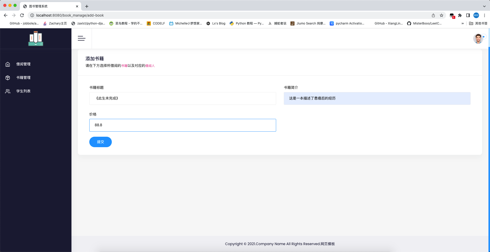

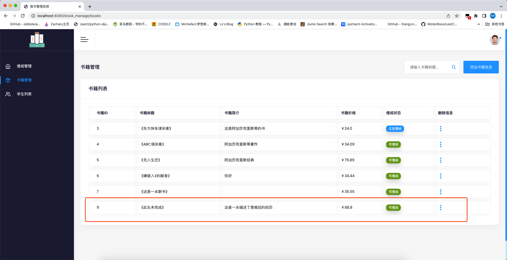

接下来修改`student.html`

```html

```

然后修改`StudentServlet`

```java
package com.book.servlet.pages;

import com.book.entity.User;
import com.book.service.BookService;
import com.book.service.impl.BookServiceImpl;
import com.book.utils.ThymeleafUtil;
import jakarta.servlet.ServletException;
import jakarta.servlet.annotation.WebServlet;
import jakarta.servlet.http.HttpServlet;
import jakarta.servlet.http.HttpServletRequest;
import jakarta.servlet.http.HttpServletResponse;
import org.thymeleaf.context.Context;

import java.io.IOException;

@WebServlet("/students")
public class StudentServlet extends HttpServlet {

    BookService service;

    @Override
    public void init() throws ServletException {
        service = new BookServiceImpl();
    }

    @Override
    protected void doGet(HttpServletRequest req, HttpServletResponse resp) throws ServletException, IOException {
        Context context = new Context();
        User user = (User) req.getSession().getAttribute("user");
        context.setVariable("nickname",user.getNickname());
        context.setVariable("student_list",service.getStudentList());
        ThymeleafUtil.process("students.html",context,resp.getWriter());
    }
}

```

最后完善一下首页的显示

修改一下`indexServlet`

```java
package com.book.servlet.pages;

import com.book.entity.User;
import com.book.service.BookService;
import com.book.service.impl.BookServiceImpl;
import com.book.utils.ThymeleafUtil;
import jakarta.servlet.ServletException;
import jakarta.servlet.annotation.WebServlet;
import jakarta.servlet.http.HttpServlet;
import jakarta.servlet.http.HttpServletRequest;
import jakarta.servlet.http.HttpServletResponse;
import org.thymeleaf.context.Context;

import java.io.IOException;

@WebServlet("/index")
public class IndexServlet extends HttpServlet {
    BookService service;

    @Override
    public void init() throws ServletException {
        service = new BookServiceImpl();
    }
    @Override
    protected void doGet(HttpServletRequest req, HttpServletResponse resp) throws ServletException, IOException {
        Context context = new Context();
        User user = (User) req.getSession().getAttribute("user");
        context.setVariable("nickname",user.getNickname());
        context.setVariable("borrow_list",service.getBorrowList());
        context.setVariable("book_count",service.getBookList().size());
        context.setVariable("student_count",service.getStudentList().size());
        ThymeleafUtil.process("index.html",context, resp.getWriter());
    }
}

```

再修改一下`index.html`

```html

```

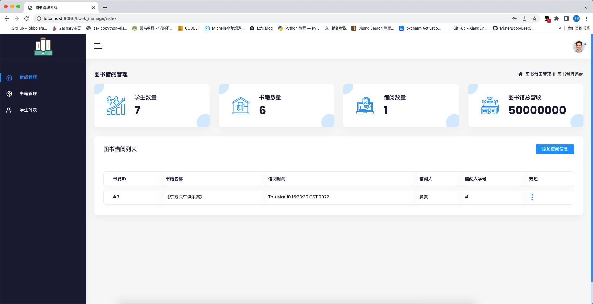

实现一下 `记住我`

修改`LoginServlet`

```java
package com.book.servlet.auth;

import com.book.service.Userservice;
import com.book.service.impl.UserServiceImpl;
import com.book.utils.ThymeleafUtil;
import jakarta.servlet.ServletException;
import jakarta.servlet.annotation.WebServlet;
import jakarta.servlet.http.Cookie;
import jakarta.servlet.http.HttpServlet;
import jakarta.servlet.http.HttpServletRequest;
import jakarta.servlet.http.HttpServletResponse;
import org.thymeleaf.context.Context;

import java.io.IOException;

@WebServlet("/login")
public class LoginServlet extends HttpServlet {

    Userservice service;

    @Override
    public void init() throws ServletException {
        service = new UserServiceImpl();
    }

    @Override
    protected void doGet(HttpServletRequest req, HttpServletResponse resp) throws ServletException, IOException {
        Cookie[] cookies = req.getCookies();
        if (cookies != null){
            String username = null;
            String password = null;
            for (Cookie cookie : cookies){
                if (cookie.getName().equals("username")){
                    username = cookie.getValue();
                }
                if (cookie.getName().equals("password")){
                    password = cookie.getValue();
                }
            }
            if (username != null && password != null){
                if (service.auth(username,password,req.getSession())){
                    resp.sendRedirect("index");
                    return;
                }
            }

        }

        Context context = new Context();
        if (req.getSession().getAttribute("login-failure") != null) {
            context.setVariable("failure", true);
            req.getSession().removeAttribute("login-failure");
        }

        // 这里是那个，重定向，当登录的时候重定向到这里index
        if (req.getSession().getAttribute("user") != null) {
            resp.sendRedirect("index");
            return;
        }
        ThymeleafUtil.process("login.html", context, resp.getWriter());
    }

    @Override
    protected void doPost(HttpServletRequest req, HttpServletResponse resp) throws ServletException, IOException {
        String username = req.getParameter("username");
        String password = req.getParameter("password");
        String remember = req.getParameter("remember-me");
        if (service.auth(username, password, req.getSession())) {
            if (remember != null){
                Cookie cookie_username = new Cookie("username", username);
                cookie_username.setMaxAge(60 * 60*  24*  7);
                Cookie cookie_password = new Cookie("password", password);
                cookie_password.setMaxAge(60*  60*  24*  7);
                resp.addCookie(cookie_username);
                resp.addCookie(cookie_password);
            }

            resp.sendRedirect("index");
        } else {
            req.getSession().setAttribute("login-failure", new Object());
            this.doGet(req, resp);
        }
    }
}
```

再修改`LogoutServlet`

```java
package com.book.servlet.auth;

import com.book.utils.ThymeleafUtil;
import jakarta.servlet.ServletException;
import jakarta.servlet.annotation.WebServlet;
import jakarta.servlet.http.Cookie;
import jakarta.servlet.http.HttpServlet;
import jakarta.servlet.http.HttpServletRequest;
import jakarta.servlet.http.HttpServletResponse;

import java.io.IOException;

@WebServlet("/logout")
public class LogoutServlet extends HttpServlet {
    @Override
    protected void doGet(HttpServletRequest req, HttpServletResponse resp) throws ServletException, IOException {
        req.getSession().removeAttribute("user");
        Cookie cookie_username = new Cookie("username","username");
        cookie_username.setMaxAge(0);
        Cookie cookie_password = new Cookie("password","password");
        cookie_password.setMaxAge(0);
        resp.addCookie(cookie_username);
        resp.addCookie(cookie_password);
        resp.sendRedirect("login");
    }
}

```

至此就可以实现所有功能

接下来实现以下项目的打包


!\[]\(image/image\_fSPxF9AfS \_.png)

然后启动一下服务器

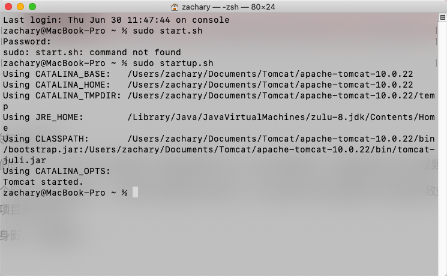

浏览器输入[http://localhost:8080/books](http://localhost:8080/books "http://localhost:8080/books")


